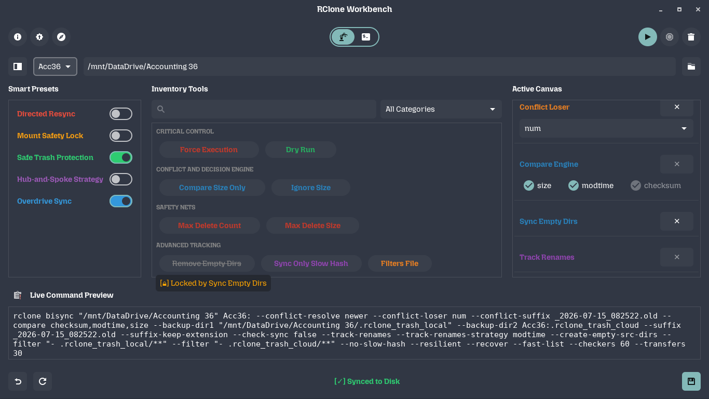
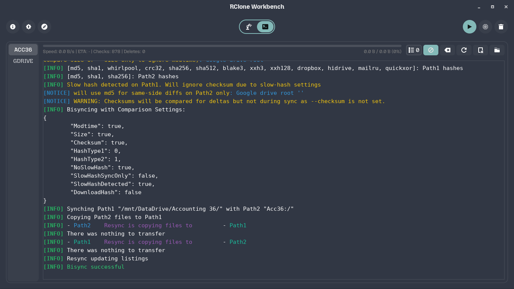
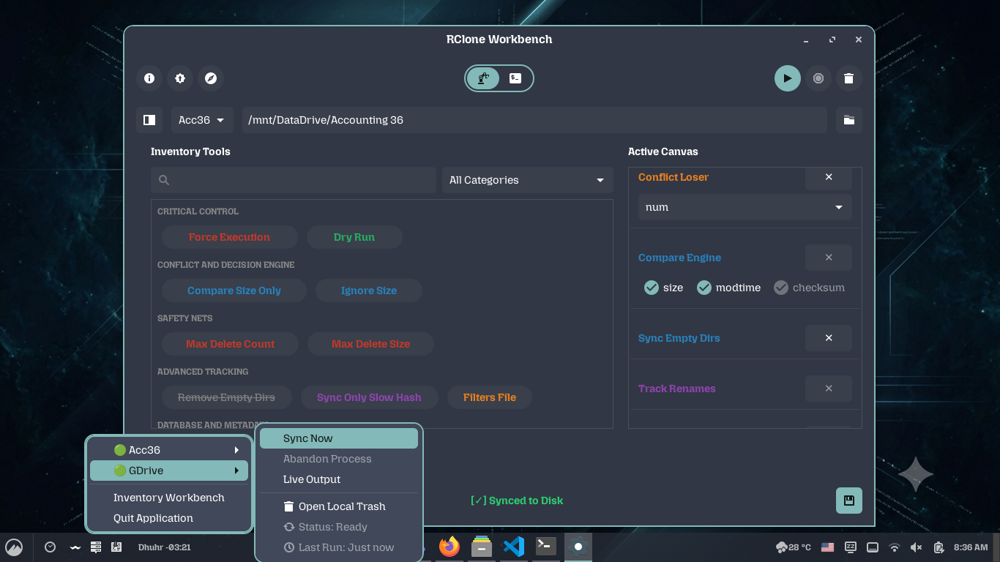

# Rclone Workbench

**Stop the "Bisync-Fear". A safety-first GUI workbench that audits your hardware, environment, and lock-states *before* running risky `rclone bisync` commands.**

[]()
[]()
[]()





## Why this exists
While standard `rclone copy` or `rclone sync` is straightforward, **bidirectional synchronization (`bisync`) is inherently fragile and risky.** A crashed state, a stale lock file, or an empty local directory can trigger a catastrophic wipe of your cloud assets.

**Rclone Workbench** acts as an opinionated structural safety layer. It wraps Rclone's complex CLI into a safe, strictly validated GTK3 desktop experience that physically prevents you from running dangerous commands without proper safety nets.

## Key Features
* **Pre-Run Environmental Audits:** Actively scans the local system before launching a sync. Blocks execution if it detects crashed states (`.lst-err`), stale locks, or empty paths.
* **Hardware Resource Protection (Overdrive):** Dynamically calculates host CPU threads and available RAM. It actively clamps parallel `--checkers` and `--transfers` to safe limits and disables RAM-heavy flags (`--fast-list`) on low-spec hardware to prevent Out-Of-Memory freezes.
* **Crash-Proof Trash Protection:** Smart Presets automatically configure dual localized and cloud-side trash bins with timestamped conflict suffixes, isolating deleted/modified files instead of permanently purging them.
* **Rules-Driven Safety:** The UI automatically maps dependencies and locks conflicting switches (e.g., activating a specific preset physically auto-locks the appropriate conflict strategies).
* **Native Drag-and-Drop (DND):** Fully supports dragging folders and text files natively from Nautilus, Nemo, and Dolphin into the UI.
* **Two-Stage Process Termination:** Intelligently handles stopping syncs. A single click sends a graceful `SIGINT` to allow rclone to safely close databases. A second click escalates to a forceful `SIGKILL`.
* **High-Performance Live Logs:** Uses efficient GTK Pango text-tagging rather than heavy UI widgets to render live `-vv` log outputs. It strips massive internal memory structs in real-time to guarantee zero UI freezing, even at 50,000+ lines.
* **Smart System Tray Integration:** Operates quietly in the background using universal, color-coded Unicode emojis (🔵🟢🔴🟡) to display real-time profile statuses, completely bypassing Linux system-theme icon contrast issues.

## Quick Start

### Prerequisites
* Linux Desktop Environment (GNOME, XFCE, KDE, etc.)
* `rclone` installed and configured (`rclone.conf` must exist)
* Python 3 and PyGObject (`python3-gi`)

### Installation
```bash
# 1. Clone the repository
git clone https://github.com/Soohaeib/Rclone_WorkBench.git
cd Rclone_WorkBench

# 2. Install Python requirements
pip install -r requirements.txt

# 3. Launch the App (Runs in the System Tray)
python3 app.py
```

*Note: The app will appear in your system tray. Click it to open the Inventory Workbench.*

## Disclaimer
This project is currently in **Alpha/Concept stage**. While it includes multiple safety-audit layers, please **test with a dry-run flag (`--dry-run`)** or a dummy directory before syncing production data. Use at your own risk.

## For Users with the Same Pain Point
If you struggle with `rclone bisync` safety, this tool might help you too.

* **Feedback:** If you find a bug that breaks your sync, please open an issue with your logs. I use this daily, so I prioritize fixing crashes.
* **Transparency:** If you want to understand how the underlying safety logic and hardware audits work before trusting it with your data, please read the [**DESIGN.md**](DESIGN.md) document.
* **Note:** This is a personal project built to solve my own specific workflow problems. I am not actively looking for feature PRs or maintaining a community roadmap, but I hope this helps you secure your own backups!